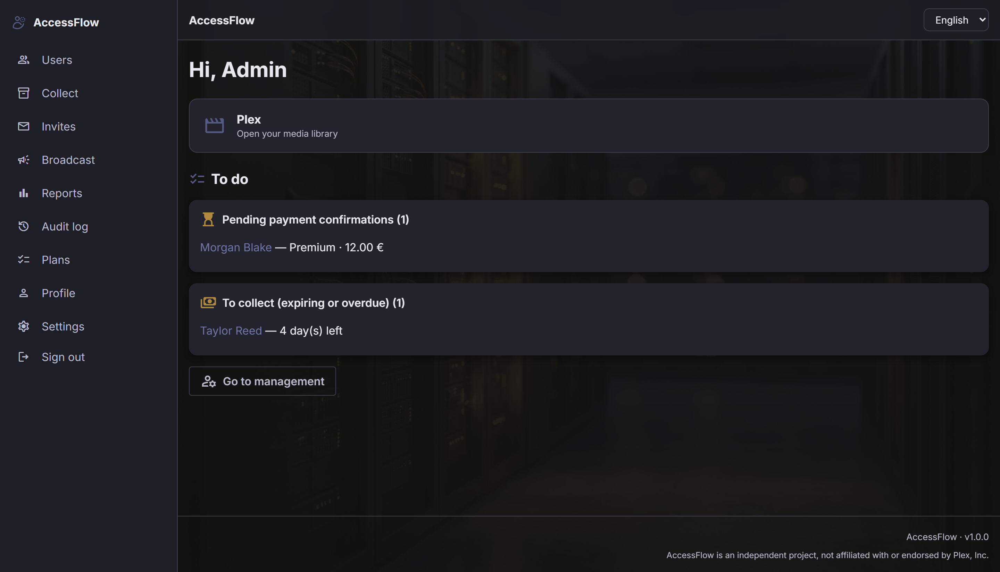
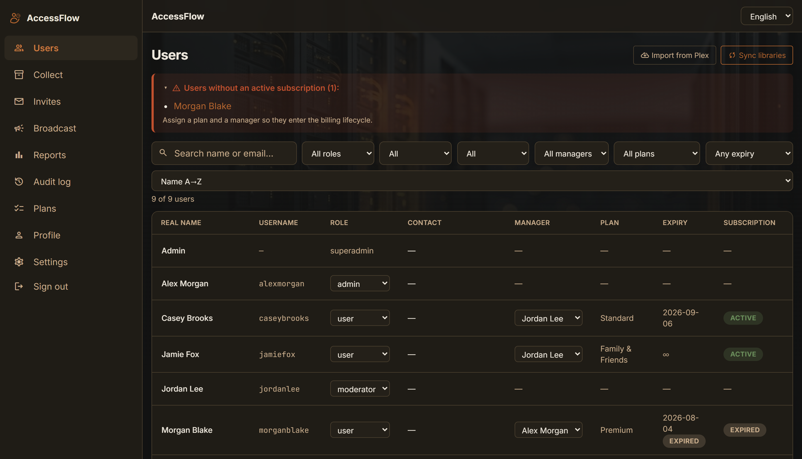
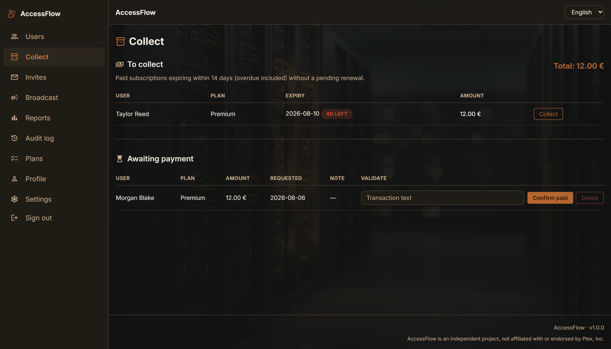
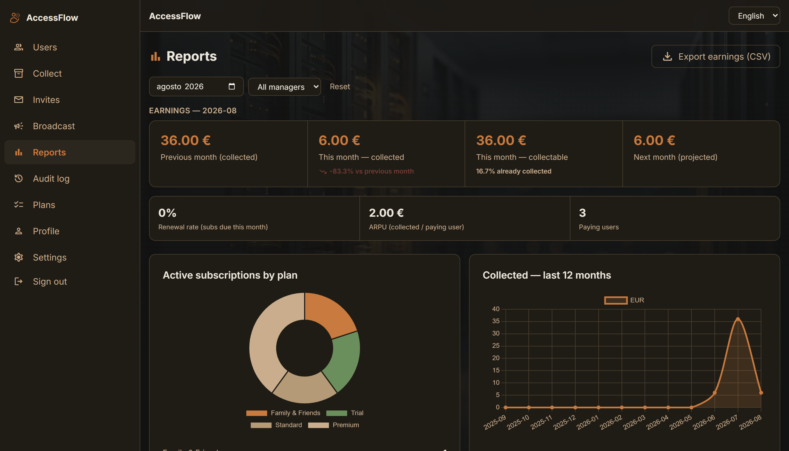

<div align="center">
  
  <h1>AccessFlow</h1>
</div>

**Self-hosted portal to manage invites for your Plex users.**

FastAPI + Jinja2/HTMX + SQLite, shipped as a single Docker container that sits behind your reverse proxy.

[](https://github.com/Pantanet96/AccessFlow/releases/latest)
[](https://github.com/Pantanet96/AccessFlow/actions/workflows/ci.yml)
[](https://hub.docker.com/r/pantanet96/accessflow)
[](https://hub.docker.com/r/pantanet96/accessflow)


[](LICENSE)

## What problem does it solve?

You share your Plex server with friends, family or other people, and keeping track of it by hand gets messy: who has been invited, who accepted, who still has access to which libraries, and when each person's access ends.

AccessFlow does that for you: it invites people to Plex, gives each one a plan with an expiry date, reminds them before it runs out, and removes their library access when it does.

## What it does

**Invite → Assign a plan → Remind → Suspend**

Invite someone from the portal, give them a plan (free, trial or timed), get a reminder before their access expires, and have their libraries unshared automatically if it lapses. Paid plans are supported too, with renewals you confirm by hand.

- **Invites** — send the Plex invite and a guide email from the portal; unaccepted ones expire after 30 days and the share is withdrawn
- **Plans and expiry** — free, trial and custom timed plans; each plan sets which libraries the user can see
- **Automatic reminders** — expiry notices via email and Telegram, on a configurable schedule
- **Automatic suspension** — past the grace period, libraries are unshared; access comes back when the user is renewed
- **Overseerr / Jellyseerr** — request permissions follow the plan and the Plex access
- **Multiple managers** — several admins or moderators can each look after their own users
- **Secure login** — optional two-step verification (TOTP), login lockout, password rules
- **Also** — Telegram bot, reports, audit log, nightly backups, 3 themes, translatable UI

## Screenshots

| Dashboard | Users |
|---|---|
|  |  |

| Collect | Reports |
|---|---|
|  |  |

Three themes (Rame, Inchiostro, Muschio), switchable from Settings.

## Quick start

```bash
cp .env.example .env   # fill in the secrets, never commit the real .env
docker compose up -d
```

App at `http://localhost:8000`, meant to sit behind your reverse proxy. The image is `pantanet96/accessflow` on Docker Hub; on Unraid use the [Community Applications template](docs/UNRAID.md).

Upgrade with `docker compose pull && docker compose up -d`.

## Documentation

Roles, plans, workflows, deploy details, security, configuration, background jobs, translations and local development are in the **[full guide](docs/GUIDE.md)**. Security details: [docs/SECURITY.md](docs/SECURITY.md).

## Star history

<div align="center">

<a href="https://www.star-history.com/?repos=Pantanet96%2FAccessFlow&type=date&legend=bottom-right">
 <picture>
   <source media="(prefers-color-scheme: dark)" srcset="https://api.star-history.com/chart?repos=Pantanet96/AccessFlow&type=date&theme=dark&legend=bottom-right&sealed_token=7pn5QW3-5HwuMjENDf7dMNWBS8PY8uTXvGhJQ-SqfBR5y37WqTlzXtoDCCdQpn035pmW3NYFrWwnCydotXrVlKqCSSBB0pkojtaMoHExQ_bRn2HdnYm4lVUjmQ85VwEb2du3HQfyMUMJc5nrC9VIrGIaGkDulFKtyv4gFPlQAgoKwsJGIos4MS8l0tbi" />
   <source media="(prefers-color-scheme: light)" srcset="https://api.star-history.com/chart?repos=Pantanet96/AccessFlow&type=date&legend=bottom-right&sealed_token=7pn5QW3-5HwuMjENDf7dMNWBS8PY8uTXvGhJQ-SqfBR5y37WqTlzXtoDCCdQpn035pmW3NYFrWwnCydotXrVlKqCSSBB0pkojtaMoHExQ_bRn2HdnYm4lVUjmQ85VwEb2du3HQfyMUMJc5nrC9VIrGIaGkDulFKtyv4gFPlQAgoKwsJGIos4MS8l0tbi" />
   
 </picture>
</a>

</div>
